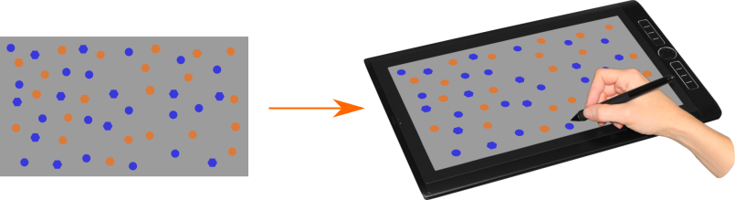

Experiment Display Visualizer 
[](https://doi.org/10.5281/zenodo.14247714)

A small utility for transforming sreenshots of perception experiments onto pictures of devices (an similar use cases), to streamline the creation of exemplary pictures of experiment setups (with verdical stimulus colors, without reflections, etc.).



Calling the script directly:

Usage: `python edv.py -t tablet-PC -d test_display.png -b 0.3 -o My_figure.png`


Installing via PIP:

`pip install git+https://github.com/jt-lab/edv`

Usage: `edv -t tablet-PC -d test_display.png -b 0.3 -o My_figure.png`

On the first run, the utility will download the templates (currently only a single tablet-PC, but this will be extended) into a folder edv_templates in your home directory. You can create templates for your own devices by creating analogous subfolders. You can also use / modify the provided template pictures under a [CC-BY-4.0](https://creativecommons.org/licenses/by/4.0/)-license. For attribution please cite this repository:  

````
Tünnermann, J. (2024). Experiment Display Visualizer [Software]. GitHub. https://doi.org/10.5281/zenodo.14247715
````
